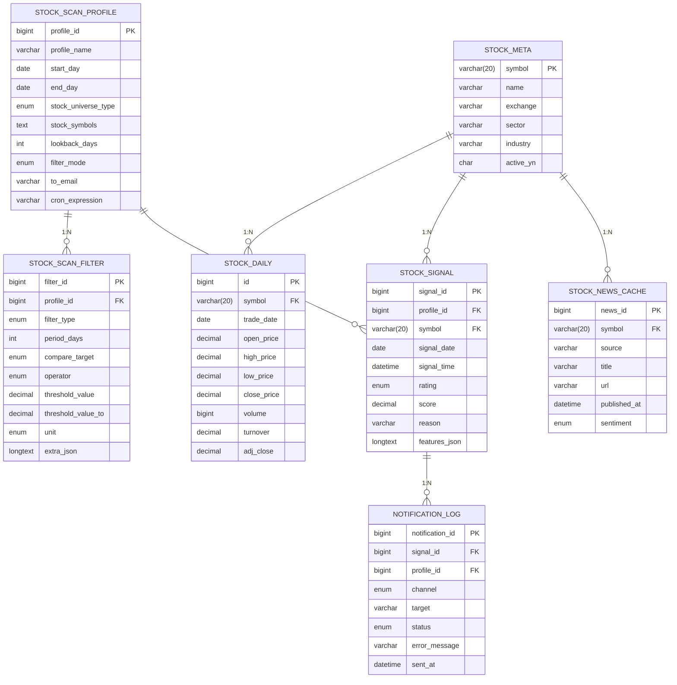
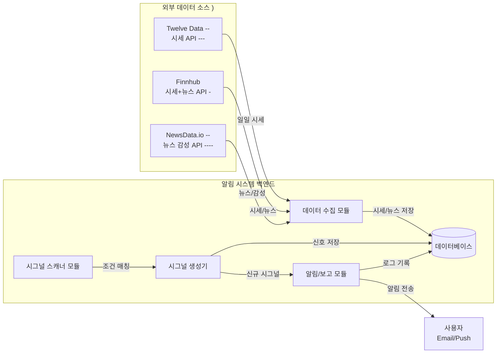
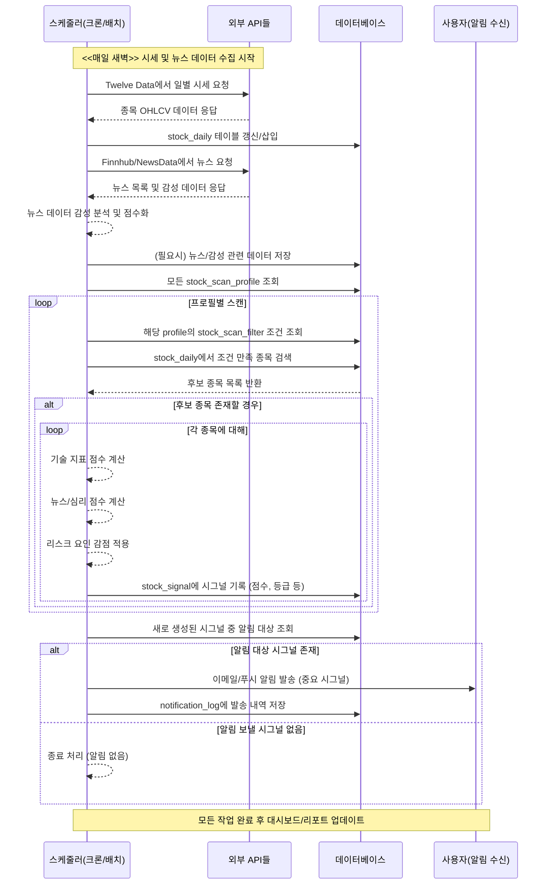

# 주식 기반 알림 시스템
## 시스템 개요

* 주식 기반 알림 시스템은 실시간 주식 시장 데이터를 모니터링하여 특정 조건을 만족하는 종목을 자동으로 감지하고 알림을 제공하는 플랫폼입니다. 이 시스템은 매일 새로운 시세와 뉴스를 수집한 후 사용자나 사전에 정의된 투자 전략(스캔 프로필)에 따라 종목을 자동 스크리닝합니다. 조건에 부합하는 종목은 **“시그널(signal)”**로 생성되며, 각 시그널에는 종목의 종합 평가 점수와 추천 등급(예: 매수/매도 신호)이 포함됩니다. 이렇게 생성된 시그널에 대해 이메일 또는 앱 푸시 형태의 알림을 전송하고, 대시보드나 리포트에 추천 상태를 출력함으로써, 사용자는 유망한 투자 기회를 놓치지 않고 효율적으로 대응할 수 있습니다.

### 주요 기능 요약

* 스캐닝 조건 설정: 사용자는 관심 있는 전략이나 조건을 스캔 프로필로 정의할 수 있습니다. 예를 들어, *“5일 이동평균 상향 돌파 및 거래량 급증”*과 같은 조건을 프로필로 등록하면 시스템이 해당 조건을 자동으로 적용합니다.

* 시그널 생성: 매일 수집되는 시세 데이터와 뉴스 데이터를 바탕으로 각 스캔 프로필의 조건을 충족하는 종목을 찾고, 이러한 종목에 대한 시그널을 생성합니다. 시그널에는 종목 정보, 발생 원인(충족한 조건), 계산된 점수와 추천 등급 등이 포함됩니다.

- 알림 전송: 생성된 시그널 중 중요한 것은 실시간으로 이메일 또는 푸시 알림으로 전송됩니다. 이를 통해 사용자는 시장 상황 변동이나 투자 기회에 대한 즉각적인 알림을 받을 수 있습니다. 알림 빈도나 대상은 프로필 설정에 따라 조절되며, 동일 종목에 대한 중복 알림을 피하기 위한 로직도 포함됩니다.

- 추천 상태 출력: 시스템은 각 시그널에 대해 **최종 추천 등급(예: 강력 매수, 중립, 매도 등)**을 산출하고 이를 대시보드나 리포트에 시각적으로 표시합니다. 사용자는 모든 후보 종목의 종합 평가 결과를 한눈에 확인하여 우선순위를 정하거나, 개별 종목의 상세 지표와 뉴스 요약을 함께 검토할 수 있습니다.

## 데이터베이스 설계

알림 시스템은 관계형 데이터베이스를 사용하여 시세, 프로필, 시그널 및 알림 내역 등을 관리합니다. 주요 테이블과 관계(ERD)는 아래와 같습니다:

## 위 ERD에서 각 테이블의 역할은 다음과 같습니다:

- stock_meta: 종목 기본 정보를 저장하는 테이블입니다. 종목의 티커(symbol)나 종목명, 거래소, 산업군 등의 메타데이터를 포함합니다. 다른 데이터 테이블에서 종목을 참조하는 기본 키로 사용됩니다.

- stock_daily: 주식의 일별 시세 데이터를 저장합니다. 각 종목(stock_id)별로 날짜별 시가, 고가, 저가, 종가, 거래량 등의 지표가 기록됩니다. 스캔 시그널을 생성할 때 이 테이블의 최신 데이터를 사용하며, 정규화된 형태로 과거 데이터도 보관합니다.

- stock_scan_profile: 사용자 또는 시스템이 정의한 스캔 전략 프로필을 관리합니다. 각 프로필에는 전략 이름과 설명이 있으며, 예컨대 “단기 모멘텀 돌파” 등의 이름으로 특정 조건 세트를 나타냅니다. (필요에 따라 프로필별 알림 설정이나 소유자 정보가 포함될 수 있습니다.)

- stock_scan_filter: 각 스캔 프로필에 연결된 상세 필터 조건을 저장합니다. 하나의 프로필은 여러 개의 필터(조건)를 가질 수 있으며, 이 테이블에 조건 유형(예: 이동평균 골든크로스, RSI 임계값 등), 비교 연산 및 값이 기록됩니다. 필터들은 같은 프로필 내에서 AND/OR 논리로 결합되어 최종 스캔 조건을 구성합니다.

- stock_signal: 스캔 조건을 충족하여 발견된 시그널을 저장합니다. 어떤 프로필(profile_id)에서 어떤 종목(stock_id)이 언제 발견되었는지를 기록하고, 해당 종목의 종합 점수(score) 및 **추천 등급(rating)**을 함께 저장합니다. 또한 시그널 발생 원인이나 관련 요약 정보를 reason 등에 담아, 나중에 사용자가 왜 이 신호가 발생했는지 이해할 수 있게 합니다.

- notification_log: 사용자에게 발송된 알림 이력을 기록하는 테이블입니다. 어떤 시그널(signal_id)에 대해 언제, 어떤 채널로 알림을 보냈는지 저장하며, 성공/실패 여부나 기타 상태를 추적합니다. 이를 통해 중복 알림을 방지하거나, 알림 시스템의 신뢰성을 모니터링할 수 있습니다.

## 외부 API 연동

-  이 시스템은 무료로 사용 가능한 외부 API들을 활용하여 시세 데이터와 뉴스 데이터를 수집합니다. 주요 연동 대상과 목적은 다음과 같습니다:

- Twelve Data API: 전 세계 주식 시세 데이터를 실시간 및 과거 시점으로 제공하는 REST API입니다
  quantoasis.tistory.com
-  Twelve Data를 통해 미국 등 글로벌 주식의 일일 OHLCV 데이터를 가져오며, 필요에 따라 내장된 기술 지표 계산 기능(예: MACD, RSI 등)도 활용합니다
quantoasis.tistory.com
- 이 API는 가볍고 사용이 간편하여 개발자 친화적이며, 무료 플랜으로도 일간 시세와 주요 기술 지표를 하루 최대 800회 호출할 수 있어 충분한 데이터를 수집할 수 있습니다
quantoasis.tistory.com
- Finnhub API: 실시간 주가, 금융 뉴스 및 기업 재무정보 등을 종합적으로 제공하는 무료 금융 API입니다. Finnhub를 통해 실시간 혹은 일간 시세를 보완 수집하고, 개별 종목에 대한 뉴스 기사나 소셜 미디어 동향 등도 가져옵니다. 예를 들어 Finnhub의 기업 뉴스 API로 특정 종목의 최근 뉴스를 조회할 수 있습니다. Finnhub는 무료로 글로벌 증시 데이터와 기관급 금융 데이터를 제공하며
finnhubio.github.io
, 추가로 미국 주식의 뉴스 심리 지표(News Sentiment) 등의 대안 데이터도 일부 지원합니다.

NewsData.io API: 뉴스 전문 API로서, 전 세계 다양한 뉴스 소스를 제공하며 기사에 대한 자연어 기반 감성 분석 결과도 제공합니다. 본 시스템에서는 특정 종목과 관련된 최신 뉴스 기사를 이 API로 검색하고, 각 기사에 부여된 감성 점수(positive/negative/neutral)를 활용합니다
newsdata.io
. NewsData.io의 감성 분석 기능을 통해 긍정 기사 비율 vs 부정 기사 비율을 파악하거나 평균 뉴스 sentiment 점수를 계산하여 종목의 뉴스 호재/악재 정도를 정량화합니다. (NewsData.io의 sentiment 필터를 사용하면 특정 긍정 또는 부정 뉴스만 추려낼 수도 있습니다.) 이처럼 무료/저비용의 뉴스 API를 활용해 별도의 NLP 엔진 구축 없이도 뉴스 기반 투자심리 지표를 시스템에 통합하였습니다.

위 외부 API들은 HTTP REST 호출로 연동되며, 각각 API 키를 통해 인증됩니다. 시스템 구성은 아래 그림과 같이 API로부터 데이터를 주기적으로 가져와 내부 DB를 갱신하고, 이를 기반으로 시그널을 생성하는 형태입니다:

- 외부 API 연동 다이어그램: 알림 시스템은 매일 Twelve Data에서 시세 데이터를, Finnhub/NewsData.io에서 뉴스 및 감성 데이터를 가져와 DB에 적재합니다. 스캐너 모듈은 DB의 최신 데이터와 프로필 조건을 대조하여 시그널을 생성하고, 알림 모듈은 이를 사용자에게 전송합니다. (무료 API의 호출 한도 내에서 적절히 스케줄링하여 데이터 수집을 수행합니다.)

### 시그널 및 추천 상태 계산

- 시스템은 발견된 종목 시그널마다 **종합 점수(score)**를 계산하고 이를 사전에 정의된 구간에 따라 **추천 등급(rating)**으로 매핑합니다. 점수 계산에는 크게 기술적 지표 기반 점수, 뉴스/감성 점수, 그리고 리스크 요인 감안 조정의 세 요소가 반영됩니다. 아래에서는 각 요소별 산정 방식을 설명합니다:

### 기술적 지표 기반 점수 산정

### 시그널 대상 종목의 차트 기술적 지표들을 분석하여 1차 점수를 부여합니다. 주요 고려 지표와 예시는 다음과 같습니다:

- 추세 지표: 주가의 추세가 긍정적일수록 높은 점수를 줍니다. 예를 들어 단기 이동평균선이 장기 이동평균선을 상향 돌파(golden cross)한 경우 추세 개선 신호로 간주하여 +점수를 부여하고, 현재 주가가 주요 이동평균(5일, 20일선 등)보다 위에 위치하면 추가 가점을 줍니다. 반대로, 하락 추세일 경우에는 해당 항목 점수를 낮게 책정합니다.

- 모멘텀 지표: RSI, MACD 등 모멘텀 지표를 활용합니다. RSI가 50 이상으로 상승세에 있거나, MACD가 신호선 위에 있고 히스토그램이 증가추세이면 매수 모멘텀으로 판단하여 점수를 높게 줍니다. 만약 RSI가 과매수 구간(예: 70 이상)일 경우 추가 상승 여력이 제한적일 수 있으므로 가점은 줄이되, 과매도 구간(예: RSI 30 이하)에서 상승 반전 시도라면 긍정 신호로 일부 점수를 줄 수 있습니다.

- 거래량 지표: 최근 거래량이 평균 대비 높거나 급증하면 수급이 몰리는 신호로 보고 가점을 부여합니다. 예를 들어 최근 거래량이 20일 평균 거래량의 2배를 넘는다면 +점수를 줍니다. 거래량 증가는 투자자 관심을 의미하므로, 시그널의 신뢰도를 높이는 요소입니다.

- 변동성 지표: 가격 변동성은 안정성의 척도로 활용됩니다. 일반적으로 낮은 변동성(예: 일정 기간 동안 주가 등락폭이 시장 평균보다 작음)은 주가 움직임이 안정적임을 뜻하므로 약간의 가점을 줄 수 있습니다. 반대로 변동성이 지나치게 높다면 (예: 며칠간 일별 변동폭이 매우 큰 종목) 기본 기술 점수 단계에서는 큰 가점을 주지 않습니다. 변동성 자체는 중립 요소로 두되, 극단적일 경우는 이후 리스크 단계에서 다룹니다.

- 기술적 지표 기반 점수는 위 요소들의 가중 합으로 계산됩니다. (예: 추세 40%, 모멘텀 30%, 거래량 20%, 변동성 10% 비중 등으로 합산하여 0~100 범위 환산). 이렇게 계산된 기술 점수는 해당 종목의 차트 기술적 매력도를 수치화한 것입니다.

### 뉴스 및 감성 점수 계산

최근 뉴스 흐름과 시장 심리를 반영하기 위해 뉴스/감성 점수를 부여합니다. 시스템은 Finnhub나 NewsData.io를 통해 대상 종목과 관련된 최신 뉴스를 일정 기간 (예: 최근 1주일) 수집합니다. 그 다음 다음과 같은 방법으로 점수를 계산합니다:

- 뉴스 감성 분석: 수집된 뉴스 기사들의 헤드라인 및 본문에 대해 **감성 분석(sentiment analysis)**을 수행합니다. NewsData.io API 등의 결과를 이용하면 각 기사별로 긍정/중립/부정으로 레이블된 감성 정보를 얻을 수 있습니다
newsdata.io
- 시스템은 예를 들어 긍정 기사 1건당 +1점, 부정 기사 1건당 -1점의 방식으로 가중 합을 내거나, 모든 관련 기사의 긍정적 비율을 백분율로 환산하여 점수화합니다. (중립 기사는 0점으로 간주)

- 핵심 뉴스 이벤트 가중치: 모든 뉴스가 동일하지는 않으므로, 중요한 뉴스에 가중치를 둘 수 있습니다. 예를 들어 회사의 실적 발표, 큰 계약 체결, 임원 변동 등의 중대한 뉴스는 기본 점수에 추가 가중치를 줍니다. 이러한 이벤트성 뉴스를 사전에 키워드로 식별하거나 (예: “실적 상회”, “신제품 출시” 등 긍정 신호) 별도의 규칙으로 처리합니다.

- 시장 전반 분위기: 특정 종목 뉴스 외에도 시장 지표(예: 공포/탐욕 지수 등)나 업종 뉴스 동향을 반영할 수도 있습니다. 그러나 본 시스템에서는 주로 해당 종목 개별 뉴스의 긍부정에 집중하며, 필요에 따라 전체 주식시장 뉴스 심리가 극도로 부정적인 경우 전체 점수에 조정계수를 적용할 수도 있습니다.

- 뉴스/감성 점수는 기술 점수와 비슷한 0~100 스케일로 환산되며, 긍정 뉴스가 압도적이면 높은 점수(호재가 많은 상황), 부정 뉴스가 많으면 낮은 점수(악재 우려 상황)를 주게 됩니다. 예를 들어 10점 만점으로 내부 계산하여 긍정 80% 이상의 종목은 10점 만점, 긍정 50%이면 5점, 이런 식으로 산정한 후 0~100에 맞게 스케일링합니다.

### 리스크 요인 및 감점 로직

- 기술 점수와 뉴스 점수의 합산이 높더라도, 특정 위험 요인이 존재하면 최종 추천에서 과도한 낙관을 피하기 위해 감점 요인을 적용합니다. 주요 리스크 요인과 감점 처리 예시는 다음과 같습니다:

- 높은 변동성: 앞서 언급했듯 변동성이 매우 높은 종목은 리스크가 크므로, 변동성 지표(예: ATR, 표준편차 등)가 임계치를 넘는 경우 점수를 일부 차감합니다. 예를 들어 최근 일주일간 일일 변동률이 평균 10%를 넘는다면 -X점을 적용하여 신중한 접근을 권고합니다.

- 급등주/단기 과열: 단기간에 급등한 종목은 조정 위험이 있으므로 감점합니다. 예를 들어 일주일 내 주가가 50% 이상 상승한 종목이 시그널로 포착되었다면, 기술적으론 강해 보여도 단기 과열로 판단하여 -점수를 부여합니다. 거래 정지나 급등주에 대한 경고가 있는 종목은 추천 등급을 한 단계 낮추는 식입니다.

- 중요 이벤트 임박: 해당 종목의 **중요 이벤트(재무제표 발표, 배당락, 제품 발표 등)**가 임박한 경우 불확실성이 높아지므로 감점 요인입니다. 특히 이벤트 전날 시그널이 발생했다면, 이벤트 결과에 따라 주가가 예측 불가능하게 출렁일 수 있으므로 일부 점수를 삭감합니다. 예를 들어 내일 실적 발표 예정인 종목은 -점수를 적용해 보수적으로 평가합니다.

- 유동성 위험: 거래량이 지나치게 적은 소형주의 경우 신호의 신뢰도가 낮으므로 감점합니다. 일 평균 거래대금이 너무 낮으면 매수/매도 타이밍에 가격 충격이 클 수 있기에 이러한 종목은 점수를 최종 단계에서 낮추는 방향으로 처리합니다.

이러한 리스크 요인들은 사전에 정의된 규칙에 따라 점수에서 일정 비율 또는 고정 점수만큼 차감됩니다. 예를 들어, 해당 종목이 어떤 리스크 조건을 만족하면 종합 점수에 -10%를 적용하는 식입니다. 여러 리스크가 중첩되는 경우 중복 차감을 막기 위해 최대치만 적용하거나, 각 리스크 항목별로 차감 후 최소 0점까지 바운딩하는 로직도 포함됩니다.

- 최종 점수 → 추천 등급 매핑

- 위와 같이 기술 점수 + 뉴스점수를 합산하고 리스크 감점을 적용하면 최종 **종합 점수(0~100)**가 산출됩니다. 시스템은 이 점수를 사전에 정의한 구간별 **추천 등급(rating)**으로 변환하여 stock_signal 테이블의 rating 필드에 저장합니다. 예를 들면 다음과 같은 등급 체계를 사용할 수 있습니다:

|최종 점수| 범위| 	추천 등급 (rating)                   | 	의미                   |
|-|-|-----------------------------------|-----------------------|
|80 ~ 100|	매우 긍정| (Strong Buy)                      | 	매우 강한 매수 신호 (최우선 관심) |
|60 ~ 79|	긍정| (Buy)	| 상승 가능성이 높아 매수 추천      |
|40 ~ 59|	중립| (Hold/Neutral)| 	뚜렷한 신호 없으며 관망        |
|20 ~ 39|	부정| (Sell)| 	하락 위험이 있어 매도 권고      |
|0 ~ 19|	매우 부정 | (Strong Sell)	| 상당히 위험, 적극 매도/회피 권고   |

- (점수-등급 매핑 예시이며, 실제 시스템에서는 5단계 이외에 필요시 3단계(매수/중립/매도) 등으로 단순화하거나 10점 척도 등을 사용할 수 있습니다.)

- 위 표처럼 점수 구간에 따라 등급 명칭과 의미를 부여함으로써, 사용자는 숫자 점수 대신 이해하기 쉬운 형태의 추천 신호를 얻게 됩니다. 예컨대 종목 A의 최종 점수가 85라면 “매우 긍정(Strong Buy)” 등급으로 분류되고, 알림 메시지나 화면에 해당 등급이 표시됩니다. 등급 명은 내부적으로 정의되며, 등급 결정 임계값은 백테스트나 도메인 전문가의 조정을 거쳐 최종 확정됩니다.

## 전체 동작 흐름

- 이 알림 시스템의 일일 작동 흐름을 종합하면 다음과 같습니다. 일반적으로 매일 장 마감 후 또는 장 시작 전 정해진 시간에 자동 배치(batch) 작업으로 실행됩니다:

- 시세 데이터 수집: 매일 새벽(예: AM 5:00) 정해진 스케줄러가 동작하여 외부 API로부터 전일 종가 기준 일일 시세 데이터를 수집합니다. Twelve Data API를 호출하여 관심 대상 모든 종목의 최신 가격 정보를 가져오고, 결과를 stock_daily 테이블에 업데이트/적재합니다. 필요시 실시간 API를 통해 장 중 데이터도 갱신할 수 있지만, 기본 동작은 일별 수집입니다.

- 뉴스 데이터 수집: 이어서 Finnhub 또는 NewsData.io API를 통해 최근 뉴스 기사들을 수집합니다. 각 종목별로 최근 N일간의 뉴스를 가져오며, 새로운 뉴스는 즉시 분석하여 감성 점수를 산출합니다. (뉴스 전문이나 헤드라인, 감성 레이블 등을 임시로 저장하거나 메모리에 유지)

- 스캔 프로필 적용: 시스템은 활성화된 모든 stock_scan_profile을 불러와 프로필별로 조건에 맞는 종목 스크리닝을 수행합니다. 예를 들어 “모멘텀 돌파” 프로필에는 해당하는 stock_scan_filter 목록을 조회하여, SQL이나 내부 연산으로 stock_daily 데이터 중 조건식을 만족하는 종목들을 검색합니다. 조건은 다중일 수 있으므로, 각 프로필마다 AND/OR 논리로 필터들을 조합해 쿼리하거나 코드 로직으로 평가합니다. 그 결과 프로필별 후보 종목 리스트가 도출됩니다.

- 시그널 생성 및 저장: 찾은 후보 종목들에 대해 각각 시그널을 생성합니다. stock_signal 테이블에 새로운 레코드를 삽입하며, 이때 해당 종목과 프로필 정보를 연결하고, 앞서 설명한 기술 점수와 뉴스/감성 점수를 계산하여 합산한 후 리스크 조정까지 거쳐 최종 종합 점수와 추천 등급을 산출합니다. 이 값들을 stock_signal.score 및 stock_signal.rating 필드에 저장하고, 신호 발생 원인을 요약하여 reason 필드에 기록합니다 (예: “5일선이 20일선 상향 돌파, 거래량 급증” 등).

- 알림 발송: 새로운 시그널 중에서 중요 등급 이상의 시그널을 선별하여 즉시 사용자 알림을 발송합니다. 예컨대 rating이 “매우 긍정(Strong Buy)” 또는 “긍정(Buy)”인 항목만 알림 대상으로 정하거나, 사용자 구독 설정에 따라 프로필별 알림 여부를 확인합니다. 알림은 사전에 구성된 채널(이메일, SMS, 푸시 등)을 통해 자동 발송되며, 이때 notification_log에 발송 기록을 남깁니다. 알림 내용에는 종목명, 추천 등급, 핵심 사유 등이 포함되어 사용자가 바로 이해할 수 있게 구성합니다.

- 결과 요약 및 종료: 모든 프로필에 대한 스캔과 알림이 끝나면, 시스템은 그날 생성된 시그널의 요약을 내부 대시보드에 업데이트하거나 리포트를 생성합니다. 운영자는 로그를 통해 **실행 현황(수집 성공 여부, 발생 시그널 수, 발송 결과 등)**을 확인하고, 필요시 프로필 튜닝이나 다음 날 준비를 합니다. 이러한 일련의 작업은 다음 일정에 다시 반복됩니다.

- 전체 동작 흐름도: 스케줄러가 일정에 따라 동작하며, 외부 API로부터 시세 및 뉴스 데이터를 수집한 뒤 DB를 업데이트합니다. 각 스캔 프로필의 조건으로 종목들을 검색하고, 조건 충족 시 시그널을 생성하여 DB에 저장합니다. 그 중 중요 시그널은 즉시 알림 발송하고 로그에 기록합니다. 마지막으로 결과를 정리하고 프로세스를 마칩니다. 이 과정은 매 거래일마다 반복되어, 시스템이 지속적으로 최신 시장 데이터를 반영하고 사용자에게 자동화된 투자 알림 서비스를 제공하도록 설계되어 있습니다.